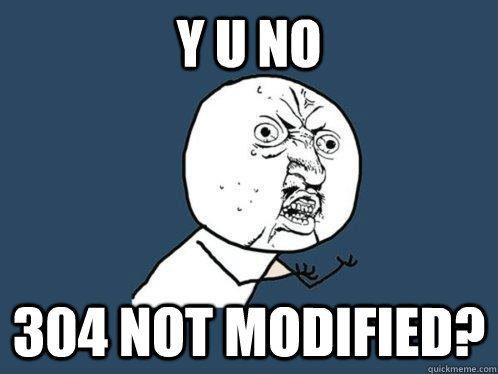
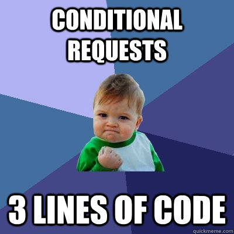

!SLIDE title bullets

# Webmachine

* [github.com/seancribbs/webmachine-ruby](https://github.com/seancribbs/webmachine-ruby)
* [github.com/seancribbs/rubyconf-webmachine](https://github.com/seancribbs/rubyconf-webmachine)
* [ruby-webmachine.heroku.com](http://ruby-webmachine.heroku.com)

!SLIDE

!SLIDE

!SLIDE

    GET /preguntas HTTP/1.1
    Accept: */*
    Accept-Language: en, x-ruby, es;q=0.5
