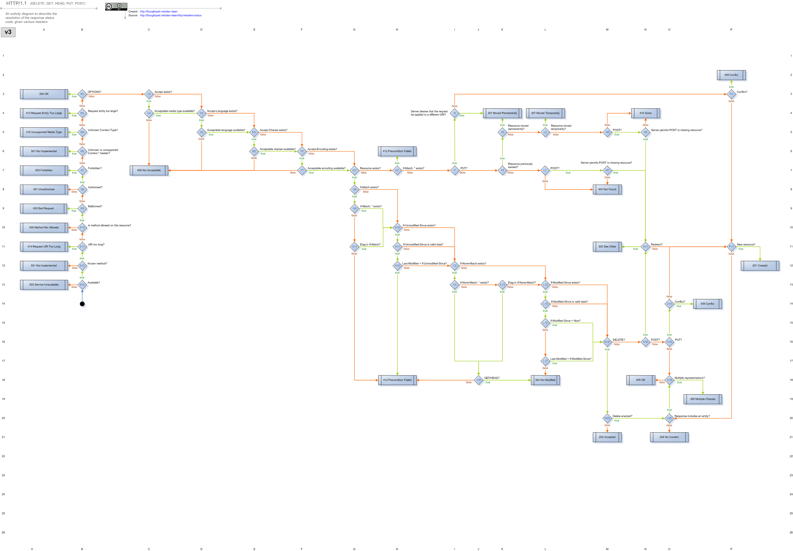

!SLIDE 

# We have a problem.

!SLIDE

# CGI/WEBrick

!SLIDE

# Rails

!SLIDE

# Sinatra/Rack

!SLIDE

# What can we do  to make this better?

!SLIDE

# HTTP is Hard

!SLIDE bullets

# Hard HTTP Questions

* Is the request method allowed?
* What media-type to return?
* Is the response cacheable?
* Did the resource move?

!SLIDE

# Does your framework help you answer those questions?

!SLIDE

# HTTP doesn't change, only your resources.

!SLIDE

# Encapsulate those hard decisions and reuse them.

!SLIDE

# Let's shape our  applications like HTTP,  with Resources.

!SLIDE bullets incremental

# A Resource is: (RFC 2616)

* Data or Service
* Identified by URI
* Representations
* Other Variances/Properties
